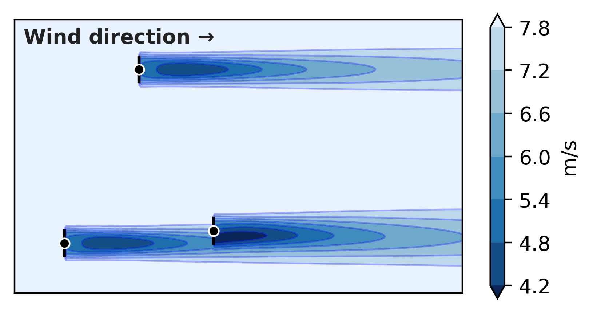

# DiffWake: A General Differentiable Wind-Farm Solver in JAX

**DiffWake** is a fully differentiable implementation of the **Cumulative–Curl (CC)** wake model for wind-farm flow simulation, written in [JAX](https://github.com/google/jax).  

It provides *end-to-end gradients* through wake, thrust, and power calculations, enabling modern machine-learning workflows, uncertainty quantification, and gradient-based layout optimization on GPUs/TPUs.

<p align="center">
  
</p>


> **Work in progress:** The codebase is being actively reorganized and parts of the functionality may not yet be stable or fully implemented.  

---

## Citation

If you use **DiffWake** in scientific work, please cite:

> **M. Bånkestad, L. Sütfeld, A. Pirinen, H. Abedi (2025).**  
> *DiffWake: A General Differentiable Wind-Farm Solver in JAX.*  
> 1st Workshop on Differentiable Systems and Scientific Machine Learning, EurIPS 2025.

**BibTeX**
```bibtex
@inproceedings{bankestad2025diffwake,
  title={DiffWake: A General Differentiable Wind-Farm Solver in JAX},
  author={B{\aa}nkestad, Maria and S{\"u}tfeld, Leon and Pirinen, Aleksis and Abedi, Hamidreza},
  booktitle={1st Workshop on Differentiable Systems and Scientific Machine Learning at EurIPS},
  year={2025}
}
```
Link is comming soon.

---

## Key Features

- **Fully differentiable Cumulative–Curl (CC) wake model**  
  Provides exact reverse-mode gradients through wake, thrust, and power computations.

- **Physics-grounded formulation**  
  Implements the Gaussian–curl wake model from  
  [Martínez-Tossas, Churchfield & Meneveau (2019)](https://doi.org/10.5194/wes-4-521-2019)  
  and the multi-turbine cumulative coupling from  
  [Bay et al. (2023)](https://doi.org/10.5194/wes-8-401-2023).

- **Compiled and efficient tensor operations**  
  Uses `jax.lax.fori_loop` and JIT compilation for stable, fast GPU/TPU execution.

- **Batchable evaluation**  
  Supports simultaneous computation across many wind speeds, directions, layouts, or parameter sets.

- **Gradient-based optimization support**  
  Compatible with L-BFGS, Adam, Optax, and custom differentiable control/optimization loops.

- **Differentiable parameter inference**  
  Includes examples for learning turbulence-intensity (TI) distributions and other inflow parameters from SCADA data.


---
##  Run Layout Optimization (L-BFGS)

DiffWake includes a built-in differentiable layout optimizer.

Example: optimize the Horns Rev wind farm:

>python optimize_layout.py \
>  --data-dir data/horn \
>  --farm-yaml cc_hornsRev.yaml \
>  --turbine-yaml vestas_v802MW.yaml \
>  --weather-npz weather_data.npz \
>  --init-mode perturb \
>  --restarts 3 \
 > --maxiter 200 \
>  --float64

---

## Requirements

To run DiffWake, you need **Python ≥ 3.10** and the following dependencies:

| Package | Purpose |
|----------|----------|
| `jax` and `jaxlib` | Differentiable array operations and JIT compilation |
| `optax` | Optimizers (e.g., L-BFGS, Adam) |
| `torch` | Used for differentiable model components |
| `numpy` | Numerical utilities |
| `pyyaml` | Reading YAML configuration files |
| `pyDOE` | Latin Hypercube Sampling for initialization |
| `matplotlib` *(optional)* | Plotting and visualization |
| `tqdm` *(optional)* | Progress bars for experiments |
---

## 🧭 TODO / Roadmap

Planned features and improvements:

- **Tilt angles** – not yet supported in the differentiable formulation.  
- **Jupyter notebooks** – add example notebooks for:  
  - gradient-based layout optimization  
  - turbulence-intensity calibration  
  - comparison with FLORIS baseline  
-  **PyTorch version** – experimental mirror for cross-validation.  
- **Differentiable yaw control** – extend optimization to $\gamma_\mathrm{yaw}$.  
-  **Parameter calibration** – extend to additional CC parameters ($k_y$, $k_z$, $x_\mathrm{nw}$, $C_T$).  
-  **Improved batching** – enable large wind-rose evaluation without recompilation.  
-  **Documentation and figures** – add user guide and visual examples.

---

## 🧩 Acknowledgments

This project builds upon the Cumulative–Curl (CC) wake formulation and utilizes the reference implementation from the FLORIS framework, developed by the National Renewable Energy Laboratory (NREL). Portions of the numerical algorithms and data structures have been adapted from the original FLORIS codebase, distributed under the BSD-3-Clause License.
 
Original FLORIS Repository: https://github.com/NREL/floris
Original License: BSD-3-Clause License (see licenses/LICENSE_FLORIS.txt)
Copyright: © 2013–2025 Alliance for Sustainable Energy, LLC.
